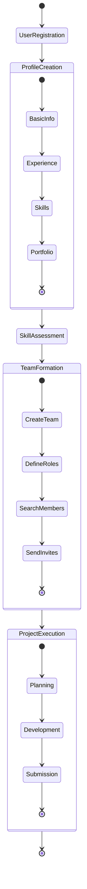
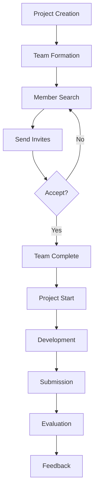
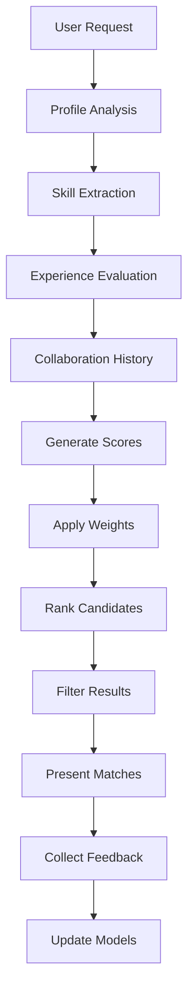

# HackBuddy: Hackathon Team Building Platform
## Comprehensive System Design Document

## 1. Full Ideation

### 1.1 Core Vision
HackBuddy aims to revolutionize hackathon team formation by creating an AI-driven platform that matches participants based on complementary skills, experience levels, and collaboration potential. The platform addresses the common challenge of finding suitable teammates outside one's immediate network.

### 1.2 Key Problems Addressed
1. **Limited Network Access**
   - Difficulty finding teammates beyond immediate circle
   - Limited access to diverse skill sets
   - Geographic constraints

2. **Skill Mismatch**
   - Unbalanced team compositions
   - Incomplete skill coverage
   - Experience level disparities

3. **Team Formation Inefficiency**
   - Time-consuming manual search
   - Unclear skill verification
   - Unreliable past performance metrics

4. **Collaboration Challenges**
   - Lack of structured team formation process
   - Limited pre-project communication
   - Unclear role definitions

### 1.3 Core Features
1. **Advanced Matching System**
   - ML-based skill compatibility analysis
   - Experience level matching
   - Collaboration history consideration
   - Role-specific expertise matching

2. **Comprehensive User Profiles**
   - Verified skill assessments
   - Project portfolio integration
   - Performance metrics tracking
   - Collaboration history

3. **Team Formation Tools**
   - Role-based team building
   - Project requirement analysis
   - Skill gap identification
   - Team composition optimization

4. **Project Management Integration**
   - Team communication tools
   - Progress tracking
   - Resource management
   - Performance analytics

## 2. System Architecture

### 2.1 Project System Architecture

#### Layer 1: Client Layer
- **Web Application (React/Next.js)**
  - User Interface Components
  - State Management (Redux)
  - Real-time Updates (Socket.io)
  - Form Management (React Hook Form)

#### Layer 2: API Gateway
- **Express.js API Server**
  - Authentication/Authorization
  - Request Routing
  - Rate Limiting
  - Caching
  - Load Balancing

#### Layer 3: Service Layer
1. **User Service**
   - Profile Management
   - Authentication
   - Skill Assessment
   - Portfolio Integration

2. **Team Service**
   - Team Formation
   - Role Management
   - Member Coordination
   - Communication

3. **Project Service**
   - Project Creation
   - Resource Management
   - Progress Tracking
   - Timeline Management

4. **Recommendation Service**
   - Skill Analysis
   - Match Scoring
   - Team Optimization
   - Performance Prediction

#### Layer 4: Data Layer
1. **Primary Database (MongoDB)**
   - User Profiles
   - Team Data
   - Project Information
   - Activity Logs

2. **Analytics Database (PostgreSQL)**
   - Performance Metrics
   - Usage Statistics
   - Match Analytics
   - Success Rates

3. **Graph Database (Neo4j)**
   - Skill Relationships
   - User Connections
   - Team Networks
   - Collaboration History

4. **Cache Layer (Redis)**
   - Session Data
   - Frequent Queries
   - Real-time Updates
   - Temporary Storage

### 2.2 Recommendation Architecture

#### Component 1: Data Collection & Processing
1. **Profile Analysis**
   - Skill Extraction
   - Experience Evaluation
   - Portfolio Assessment
   - GitHub Integration

2. **Historical Data**
   - Past Collaborations
   - Project Success Rates
   - Team Performance
   - User Ratings

#### Component 2: ML Pipeline
1. **Feature Engineering**
   - Skill Vector Generation
   - Experience Normalization
   - Collaboration Metrics
   - Performance Indicators

2. **Model Architecture**
   - BERT for Text Analysis
   - Graph Neural Networks for Relationships
   - XGBoost for Ranking
   - Ensemble Methods for Final Scoring

#### Component 3: Scoring System
1. **Primary Factors**
   - Skill Compatibility (30%)
   - Technical Expertise (20%)
   - Experience Match (15%)
   - Collaboration History (15%)
   - User Ratings (10%)
   - Role Expertise (5%)
   - Project Success (5%)

2. **Adjustment Factors**
   - Recent Activity Bonus
   - Domain Expertise Multiplier
   - Team Balance Factor
   - Innovation Score

## 3. Use Case Diagram

## 4. Workflow Diagrams

### 4.1 Project Workflow

### 4.2 Recommendation Workflow

The system design incorporates advanced ML-based recommendation systems, robust data processing pipelines, and scalable architecture to support efficient team formation and collaboration in hackathon environments. The modular design allows for easy scaling and feature additions while maintaining high performance and reliability.
